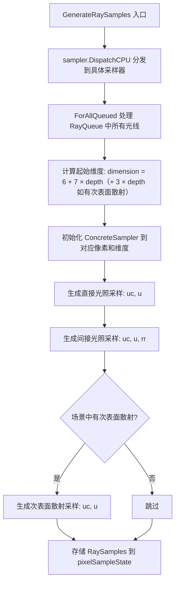

# samples.cpp

## 概述
该文件是 `WavefrontPathIntegrator` 的采样生成实现部分，不对应独立的头文件。它实现了 `GenerateRaySamples()` 方法，负责在每个波前深度开始前，为当前所有活跃光线生成所需的随机采样值（包括直接光照、间接光照和次表面散射的采样参数）。这些预生成的采样值存储在 `PixelSampleState` 中，供后续的材质评估和光源采样阶段使用。

## 主要类与接口
| 类/结构体/函数 | 说明 |
|---|---|
| `WavefrontPathIntegrator::GenerateRaySamples(wavefrontDepth, sampleIndex)` | 非模板版本的分发函数，通过 `sampler.DispatchCPU` 将调用转发到具体采样器类型的模板版本（排除 MLTSampler 和 DebugMLTSampler） |
| `WavefrontPathIntegrator::GenerateRaySamples<ConcreteSampler>(wavefrontDepth, sampleIndex)` | 模板版本，对光线队列中的每个活跃光线工作项并行生成 `RaySamples` 结构体 |

## 算法流程图

## 依赖关系
- **依赖**：`pbrt/pbrt.h`、`pbrt/samplers.h`、`pbrt/wavefront/integrator.h`
- **被依赖**：作为 `WavefrontPathIntegrator` 方法的实现文件，由 `integrator.cpp` 中的 `Render()` 循环在每个波前深度的求交之前调用
