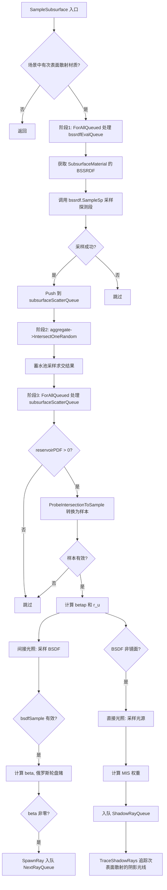

# subsurface.cpp

## 概述
该文件是 `WavefrontPathIntegrator` 的次表面散射（Subsurface Scattering, SSS）实现部分，不对应独立的头文件。它实现了 `SampleSubsurface()` 方法，处理具有 BSSRDF（双向次表面散射反射分布函数）属性的材质。该方法包含三个关键步骤：获取 BSSRDF 并生成探测光线、执行随机求交采样、处理出射散射（包括间接光照和直接光照的采样）。

## 主要类与接口
| 类/结构体/函数 | 说明 |
|---|---|
| `WavefrontPathIntegrator::SampleSubsurface(wavefrontDepth)` | 次表面散射主方法，协调 BSSRDF 评估、探测光线求交和出射散射处理三个阶段 |

## 算法流程图

## 依赖关系
- **依赖**：`pbrt/pbrt.h`、`pbrt/bssrdf.h`、`pbrt/interaction.h`、`pbrt/lightsamplers.h`、`pbrt/samplers.h`、`pbrt/util/sampling.h`、`pbrt/util/spectrum.h`、`pbrt/wavefront/integrator.h`
- **被依赖**：作为 `WavefrontPathIntegrator` 方法的实现文件，由 `integrator.cpp` 中的 `Render()` 循环在每个波前深度的材质评估之后调用
