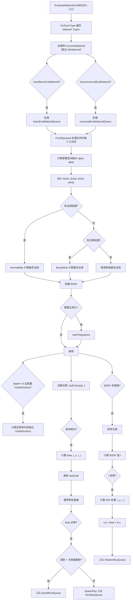

# surfscatter.cpp

## 概述
该文件是 `WavefrontPathIntegrator` 的表面散射（Surface Scattering）实现部分，不对应独立的头文件。它实现了 `EvaluateMaterialsAndBSDFs()` 及其辅助模板方法，负责在光线与表面交点处评估材质属性、构建 BSDF、计算纹理滤波微分、处理法线贴图和位移贴图、采样间接光照方向和直接光照光源。这是波前渲染管线中计算量最大、逻辑最复杂的核心模块之一。

## 主要类与接口
| 类/结构体/函数 | 说明 |
|---|---|
| `EvaluateMaterialCallback` | 回调结构体，用于通过 `ForEachType` 对每种具体材质类型调用 `EvaluateMaterialAndBSDF`（跳过 `MixMaterial`） |
| `WavefrontPathIntegrator::EvaluateMaterialsAndBSDFs(wavefrontDepth, movingFromCamera)` | 入口方法，对所有材质类型执行分发 |
| `WavefrontPathIntegrator::EvaluateMaterialAndBSDF<ConcreteMaterial>(wavefrontDepth, movingFromCamera)` | 中间模板方法，根据纹理评估器类型（Basic/Universal）选择相应队列并调用具体实现 |
| `WavefrontPathIntegrator::EvaluateMaterialAndBSDF<ConcreteMaterial, TextureEvaluator>(evalQueue, movingFromCamera, wavefrontDepth)` | 核心模板方法，执行完整的材质评估和光线散射采样流程 |

## 算法流程图

## 依赖关系
- **依赖**：`pbrt/pbrt.h`、`pbrt/base/bxdf.h`、`pbrt/bxdfs.h`、`pbrt/cameras.h`、`pbrt/interaction.h`、`pbrt/materials.h`、`pbrt/options.h`、`pbrt/textures.h`、`pbrt/util/check.h`、`pbrt/util/containers.h`、`pbrt/util/spectrum.h`、`pbrt/util/vecmath.h`、`pbrt/wavefront/integrator.h`
- **被依赖**：作为 `WavefrontPathIntegrator` 方法的实现文件，由 `integrator.cpp` 中的 `Render()` 循环在每个波前深度的求交和逃逸/发射处理之后调用
