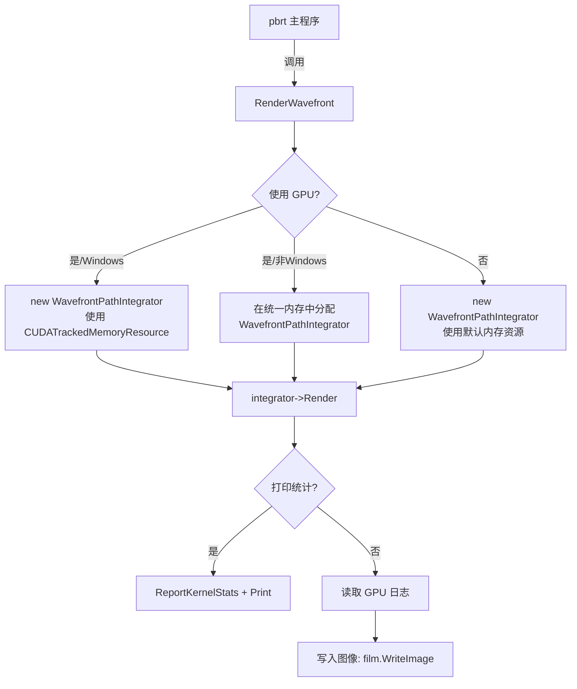

# wavefront.h / wavefront.cpp

## 概述
该文件是波前渲染器的顶层入口，提供了 `RenderWavefront()` 函数作为外部调用的唯一接口。它负责创建 `WavefrontPathIntegrator` 实例（根据是否使用 GPU 选择不同的内存分配策略），执行渲染、收集统计信息、读取 GPU 日志，并将最终图像写入文件。该文件是从 pbrt 主程序调用波前渲染路径的桥梁。

## 主要类与接口
| 类/结构体/函数 | 说明 |
|---|---|
| `RenderWavefront(BasicScene&)` | 波前渲染的顶层入口函数，创建积分器实例并驱动整个渲染流程 |

## 架构图

## 依赖关系
- **依赖**：`pbrt/wavefront/wavefront.h`、`pbrt/wavefront/integrator.h`、`pbrt/gpu/memory.h`（GPU 构建时）、`pbrt/scene.h`
- **被依赖**：pbrt 主程序（作为波前渲染的入口点）
