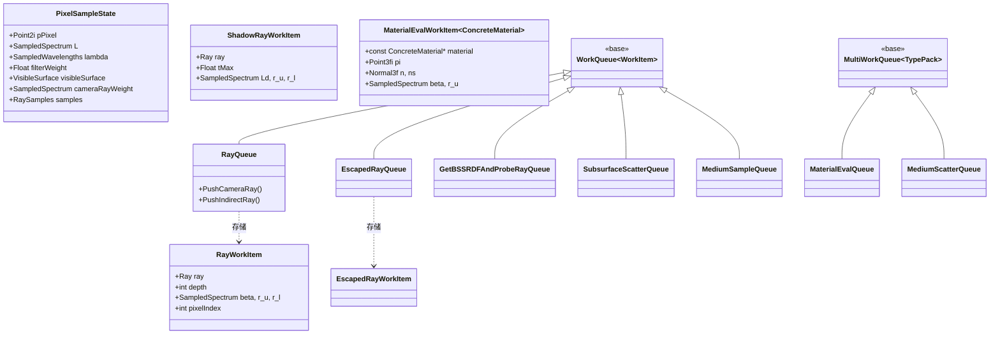

# workitems.h / workitems.soa

## 概述
该文件定义了波前路径追踪积分器中所有工作项（work item）的数据结构，以及基于 SOA（Structure of Arrays）布局的特化版本。工作项是波前架构的核心数据单元，每种类型对应渲染管线中一个特定阶段的输入数据。`.soa` 文件通过 pbrt 的自定义 SOA 代码生成器，为每个工作项结构体自动生成高效的 SOA 内存布局代码。同时该文件还定义了各种专用工作队列类。

## 主要类与接口
| 类/结构体/函数 | 说明 |
|---|---|
| `RaySamples` | 光线采样值结构体，包含直接光照、间接光照和次表面散射的采样参数 |
| `SOA<RaySamples>` | RaySamples 的 SOA 特化，使用紧凑的 `Float4` 布局存储采样数据 |
| `PixelSampleState` | 像素采样状态，存储像素坐标、累积辐射度、波长、滤波权重、可见表面和采样值 |
| `RayWorkItem` | 活跃光线的工作项，携带光线、深度、波长、路径吞吐量 beta、MIS 权重 r_u/r_l 等 |
| `EscapedRayWorkItem` | 未命中场景的逃逸光线工作项 |
| `HitAreaLightWorkItem` | 命中面光源的光线工作项 |
| `ShadowRayWorkItem` | 阴影光线工作项，携带光线、最大距离、待验证的直接光照贡献 Ld |
| `GetBSSRDFAndProbeRayWorkItem` | BSSRDF 评估和探测光线生成的工作项 |
| `SubsurfaceScatterWorkItem` | 次表面散射工作项，携带探测段端点、BSSRDF、蓄水池采样数据 |
| `MediumSampleWorkItem` | 介质采样工作项，携带光线、交点信息和材质数据 |
| `MediumScatterWorkItem<PhaseFunction>` | 介质散射工作项模板，携带相函数指针 |
| `MaterialEvalWorkItem<ConcreteMaterial>` | 材质评估工作项模板，携带交点的完整几何和材质信息 |
| `RayQueue` | 光线工作队列，提供 `PushCameraRay` 和 `PushIndirectRay` 专用入队方法 |
| `ShadowRayQueue` | 阴影光线工作队列（`WorkQueue<ShadowRayWorkItem>` 的别名） |
| `EscapedRayQueue` | 逃逸光线工作队列，提供从 `RayWorkItem` 直接转换并入队的方法 |
| `GetBSSRDFAndProbeRayQueue` | BSSRDF 评估工作队列 |
| `SubsurfaceScatterQueue` | 次表面散射工作队列 |
| `MediumSampleQueue` | 介质采样工作队列，提供多种 `Push` 重载 |
| `MediumScatterQueue` | 介质散射多工作队列（基于 `MultiWorkQueue` 和 `PhaseFunction::Types`） |
| `MaterialEvalQueue` | 材质评估多工作队列（基于 `MultiWorkQueue` 和 `Material::Types`） |
| `HitAreaLightQueue` | 面光源命中工作队列 |

## 架构图

## 依赖关系
- **依赖**：`pbrt/pbrt.h`、`pbrt/base/sampler.h`、`pbrt/film.h`、`pbrt/lightsamplers.h`、`pbrt/materials.h`、`pbrt/ray.h`、`pbrt/util/containers.h`、`pbrt/util/soa.h`、`pbrt/wavefront/workqueue.h`、自动生成的 `wavefront_workitems_soa.h`
- **被依赖**：`pbrt/wavefront/integrator.h`、`pbrt/wavefront/aggregate.h`、`pbrt/wavefront/intersect.h` 以及几乎所有 wavefront 目录下的实现文件
