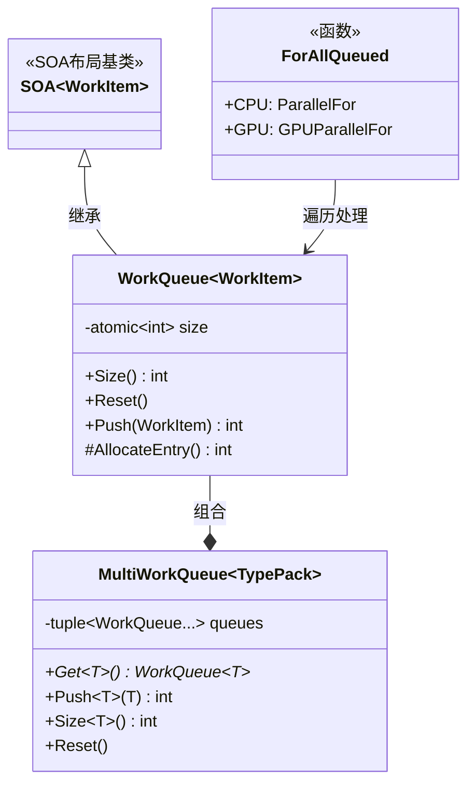
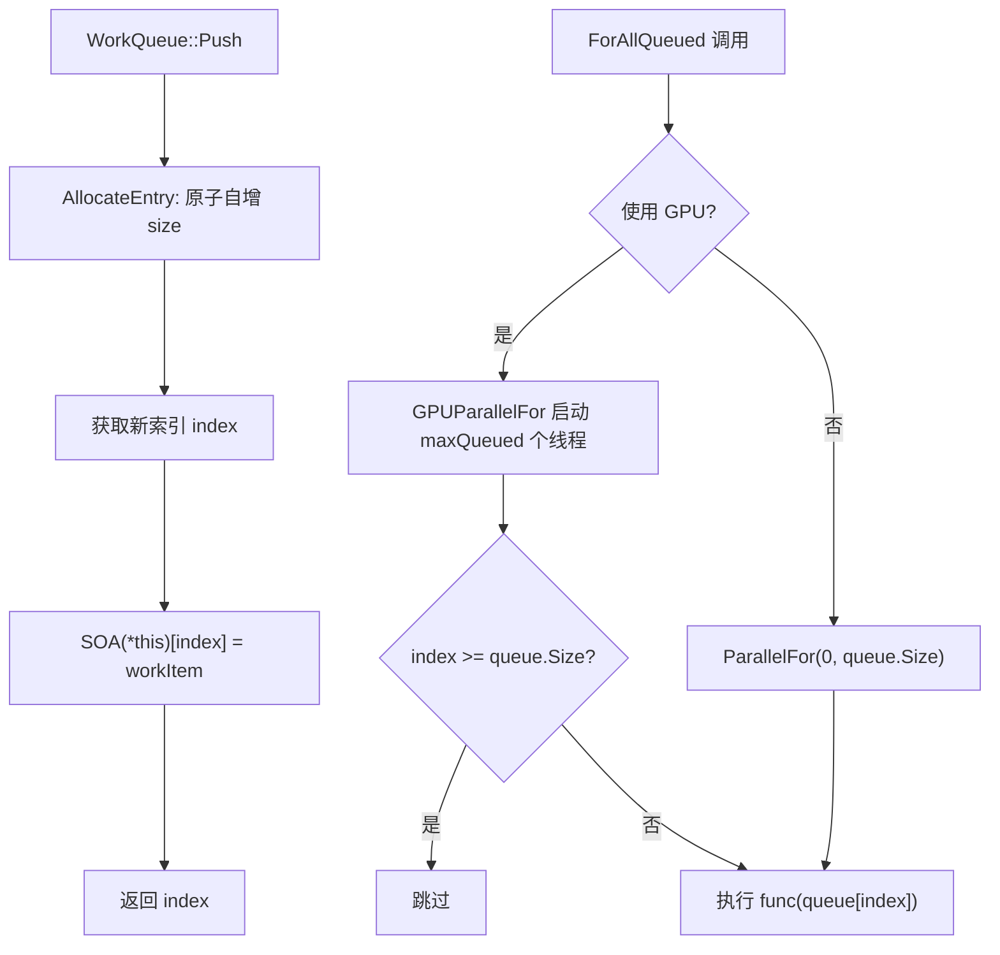

# workqueue.h

## 概述
该头文件定义了波前路径追踪架构中的通用工作队列基础设施。`WorkQueue` 是一个基于 SOA 布局的线程安全队列模板类，支持 CPU 和 GPU 上的原子化并发入队操作。`MultiWorkQueue` 则将多个类型的工作队列组合在一起，用于处理材质评估和介质散射等需要按具体类型分发的场景。此外还提供了 `ForAllQueued` 辅助函数，用于对队列中所有工作项执行并行处理。

## 主要类与接口
| 类/结构体/函数 | 说明 |
|---|---|
| `WorkQueue<WorkItem>` | 通用工作队列模板类，继承自 `SOA<WorkItem>`，通过原子计数器实现线程安全的入队操作 |
| `WorkQueue::Size()` | 返回当前队列中的工作项数量，使用 relaxed 内存序 |
| `WorkQueue::Reset()` | 将队列大小重置为 0 |
| `WorkQueue::Push(WorkItem)` | 原子地分配一个新槽位并写入工作项 |
| `WorkQueue::AllocateEntry()` | 受保护方法，通过原子 fetch_add 分配新条目索引 |
| `ForAllQueued()` | 模板函数，对队列中所有有效工作项并行执行给定的函数，根据配置选择 CPU 的 `ParallelFor` 或 GPU 的 `GPUParallelFor` |
| `MultiWorkQueue<TypePack<Ts...>>` | 多类型工作队列容器，内部为每个类型维护一个独立的 `WorkQueue` |
| `MultiWorkQueue::Get<T>()` | 获取特定类型 T 对应的工作队列指针 |
| `MultiWorkQueue::Push<T>()` | 向特定类型的子队列中推入工作项 |
| `MultiWorkQueue::Reset()` | 重置所有子队列 |

## 架构图

## 算法流程图

## 依赖关系
- **依赖**：`pbrt/pbrt.h`、`pbrt/options.h`、`pbrt/gpu/util.h`（GPU 构建时）、`pbrt/util/parallel.h`、`pbrt/util/pstd.h`、CUDA 原子操作头文件（GPU 编译时）
- **被依赖**：`pbrt/wavefront/workitems.h`（所有具体工作队列类型均基于此模板）、`pbrt/wavefront/integrator.h`
